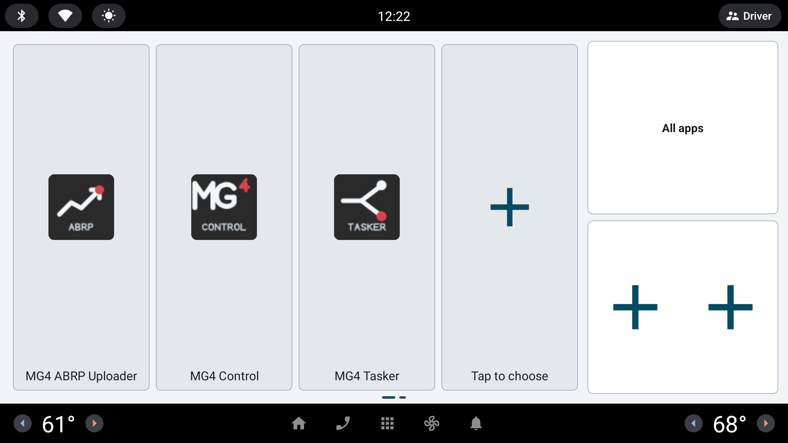

# EVLauncher

<p align="center"></p>

[](https://github.com/malys/EVLauncher/actions/workflows/tests.yml)
[](https://github.com/malys/EVLauncher/actions/workflows/security.yml)
[](https://github.com/malys/EVLauncher/actions/workflows/unstable.yml)
[](https://github.com/malys/EVLauncher/releases)
[](LICENSE)
[](https://malys.github.io/EVSuite/)

> ⚠️ **This software runs on a vehicle head unit.** Do not interact with it while
> driving. Read [DISCLAIMER.md](DISCLAIMER.md) before installing.
> MG and MG4 are third-party marks used only to identify compatibility; this independent
> project is not affiliated with or approved by SAIC Motor or MG Motor.

A simple custom home launcher for the MG4 head unit (1920×720, landscape): a grid of up to
12 favourite apps, an all-apps drawer, and a customisable metrics page, in the suite's dark
Material 3 theme.

EVLauncher is **independent**. It needs no other EVSuite app; its metrics page reads the
vehicle through the shared [EVHardware](https://github.com/malys/EVHardware) layer (read-only).

## Part of EVSuite

EVLauncher is one app of [**EVSuite**](https://malys.github.io/EVSuite/), a family of independent,
offline-first apps for the MG4 head unit (Android Automotive OS 9). Each app installs on its
own — pick only what you need. User guides and install instructions:
<https://malys.github.io/EVSuite/>.

Discover the rest of the suite:

[](https://github.com/malys/EVProfile)
[](https://github.com/malys/EVTasker)
[](https://github.com/malys/EVABRPUploader)
[](https://github.com/malys/EVChargePilot)
[](https://github.com/malys/EVSwipe)
[](https://github.com/malys/EVHardware)

---

## Contents

- [Part of EVSuite](#part-of-evsuite)
- [Screenshots](#screenshots)
- [Upgrading from an earlier build](#upgrading-from-an-earlier-build)
- [Features](#features)
- [Changing a pinned app](#changing-a-pinned-app)
- [Second screen (metrics)](#second-screen-metrics)
- [Install](#install)
- [Building](#building)
- [Project documents](#project-documents)
- [Security](#security)
- [Contributing](#contributing)
- [Legal](#legal)

## Screenshots

<p align="center">
  
</p>

<p align="center">
  
</p>

## Upgrading from an earlier build
The application id changed from `com.mg4.launcher.simple` to **`com.evsuite.launcher`**,
and the app is now signed with the **EVSuite platform key** (the same key as the other
EVSuite apps). Either change alone forces a fresh install: **uninstall the previous
version first**, then install the new one, then set it as the default home again from
Android settings. Favorites are stored per-app, so they are reset.

## Features
- **Swipeable two-page home**: a horizontal carousel (`ViewPager2`). Swipe left/right
  between the launcher home (page 1) and a customisable, read-only **metrics** screen
  (page 2) that carries head-unit and vehicle values in one grid. A SAIC-style bar
  indicator at the bottom centre shows the current page. The home is always page 1, so
  pressing Home lands on the favourites grid whatever you last swiped to.
- **Favorite cards** (page 1): a grid of cards, each launching one app of your
  choice — up to **12**. Tap a card to open its app; **long-press** to replace or
  remove it. The last tile is always a **+**, which is how a new app is added.
  Rows and columns follow the number of cards (1 row up to 4 apps, 2 rows up to 8,
  3 rows beyond), so the tiles stay as large as the count allows.
- **Fourth column**:
  - **All apps** (top card): every launchable app, in a grid.
  - **Two fixed shortcuts** (bottom card): the Android 9 default **Files** and
    **Settings** apps, side by side as icons.
- **System apps**: inside the *All apps* drawer, the header filters system apps
  (`FLAG_SYSTEM`) and provides a **back** button to return home.
- **App info shortcut**: **long-press** any entry in the app drawer to jump straight to
  its Android app-info screen.
- **EVSuite manager**: the **EVSuite** button checks stable/offline GitHub releases only
  on request, shows changelogs, and downloads verified APKs for manual installation
  (see [Install](#install)).
- **EVSuite theme**: dark Material 3 on the shared `ev_*` colour and spacing
  tokens, with the suite's 72 dp touch target. Dark is imposed rather than
  following the system: the screen faces the driver at night, and a light
  background filling the windscreen is glare, not a preference.
- **Persisted favorites**: the chosen apps are saved across reboots (a home page
  built with an older three-slot version is migrated on first launch).

## Changing a pinned app
**Long-press** a card to choose between *replace* and *remove*; replacing opens the
app picker. To **add** one, tap the trailing **+** tile and pick an app. Your choices
are saved across reboots.

## Second screen (metrics)
Swipe right from the home to reach the metrics page (`MetricsFragment` /
`res/layout/fragment_metrics.xml`). It is one customisable grid of head-unit and
vehicle values, refreshed while the page is visible — the system cards every 3 s, the
vehicle snapshot at most every 5 s.

**Customising it works exactly like the home page**: tap the trailing **+** tile to open
the full-screen metric picker, **long-press** a card to *replace* or *remove* it. Up to
twelve cards, laid out on one, two or three rows. Your choices are saved across reboots.

A fresh install shows the seven cards the two old fixed pages showed:

- **Device**: manufacturer + model, Android version (release · API), uptime, and the
  installed launcher version.
- **Memory**: used / total RAM.
- **Storage**: free / total internal storage.
- **Network**: active connection type (Wi-Fi / mobile / Ethernet / offline) and, on
  Wi-Fi, the negotiated link speed.
- **Charge**: state of charge, in percent.
- **Range**: remaining range, in kilometres.
- **Charging**: the charging state — charging on AC or DC, plugged in and not charging,
  complete, faulted, or unplugged — with whether the port is connected underneath it.

The picker offers forty-three metrics in two sections.

**Head unit** — device, chipset, CPU load, memory, storage, network, IP address, data used
today / this month / since boot, date, time, weather, uptime, Android version, kernel, screen,
launcher version.

The **weather** card is the only one that asks for a permission. It reads the head unit's own
weather service, which answers for a position, so the location permission is requested the
first time you display the card — never at launch — and the position subscription lives only
while the page is on screen. Add no weather card and the launcher never asks and never
subscribes.

**Vehicle** — what this car actually answers: charge, range, charging, outside temperature,
gear, and the climate state (power, A/C, auto, eco, recirculation, fan, driver and passenger
targets). They come from the SAIC vendor services, which need no car permission, which is why
they work. The standard AAOS metrics that used to be offered alongside them — speed, cabin
temperature, odometer, charge port, tyre pressures, battery power / energy / capacity /
temperature — are **gone**: every one is behind a car permission this launcher does not hold,
so none could ever show a number. `docs/CR-011-metrics-page.md` lists which and why re-adding
one is a separate boundary review.

**A value the car does not report is shown as `—`, never as zero**, with a caption saying
which kind of silence it is: *no vehicle data* when the vehicle layer is not answering at all,
*unavailable on this car* when everything else answered and this one signal did not.

Every value comes from **EVHardware**, the suite's shared vehicle layer. The launcher holds no
property id, no vendor transaction and no setter of its own, and `VehicleBoundaryTest` fails
the build if one appears. Two read-only car permissions are held —
`android.car.permission.CAR_ENERGY` and `android.car.permission.CAR_VENDOR_EXTENSION` — and
neither permits a write. Nothing is read while the page is off-screen, nothing is stored, and
a driver who never swipes this far never binds the vehicle layer at all.

Which permissions were deliberately refused, and what a now-playing card would have cost:
[docs/CR-010-vehicle-page.md](docs/CR-010-vehicle-page.md). Why the vehicle page and the
system page later became one customisable grid, and which metrics a refused permission keeps
at `—`: [docs/CR-011-metrics-page.md](docs/CR-011-metrics-page.md).

## Install

Download the APK from the [releases](https://github.com/malys/EVLauncher/releases) page
(stable tags; the rolling `unstable` pre-release is the other [channel](#channels)), copy it
to the head unit, then park the car, open **Files**, select the APK, review Android's app
name and permissions, and tap **Install**. Set EVLauncher as the default home from Android
settings (see [Upgrading](#upgrading-from-an-earlier-build) if you had an earlier build).

To fetch other EVSuite apps from the launcher itself: **All apps → EVSuite**, tap
**Refresh** to check each app's latest stable/offline GitHub release, select a version to
read its changelog, then choose **Download APK** and a save location, and install it from
**Files** as above. Repositories and package names use a fixed allowlist, every APK must
carry the suite signing certificate, and the launcher cleans private EVSuite APKs after
export.

## Building
Standard Android project (Java, AGP 9.1.1, Gradle 9.3.1, `compileSdk 36`, `minSdk 28` /
`targetSdk 34`). JDK 17 is required and pinned in `mise.toml`. The `EVHardware` submodule is
included as the `:evhardware` subproject — clone with `--recurse-submodules`, or run
`git submodule update --init` before the first build.

```
mise run build            # stable debug APK
mise run build-unstable   # unstable debug APK (manual updates only)
mise run test             # JVM unit tests, both channels
mise run permissions      # permission-drift gate, same check the CI runs
```

Or directly:

```
./gradlew assembleStableDebug
./gradlew assembleUnstableDebug
```

APKs land under `app/build/outputs/apk/<channel>/debug/`.

To sign locally, in `gradle.properties` (never committed) or as environment
variables — the same EVSuite platform key used by the other EVSuite apps:

```
evsuite.keystore=/path/to/platform.keystore
evsuite.keystore.password=…
evsuite.key.alias=platform
evsuite.key.password=…
```

### Channels
Two build flavors, like the sibling apps:

- **stable** — tagged releases with no self-update or installer capability.
- **unstable** — a pre-release published on every push to `master`, also without
  self-update or installer capability. Application id
  `com.evsuite.launcher.unstable`, so it installs beside a stable build (only one
  of the two can be the default home at a time).

Both channels update manually. The suite manager validates HTTPS and the GitHub allowlist
at every redirect, verifies package identity and the suite certificate, then asks Android
where to save the APK. It never invokes an installer, and private temporary APKs are always
deleted. See [SECURITY.md](SECURITY.md).

### Emulator

```
mise run emulator-setup    # one-off: SDK images + both AVDs (needs /dev/kvm)
mise run emulator-screen   # API 28 at MG4 panel geometry — the useful one for UI work
mise run emulator-car      # API 33 Automotive — automotive system UI, wrong OS version
mise run run               # build, install and start on whatever device is connected
mise run emulator-stop
```

Neither profile is faithful on both axes: the vehicle runs AAOS 9 (API 28), but Google
publishes no Automotive system image below API 33. The screen profile is the one that
matters here — the project targets 1920x1080 @ 160dpi
(`SWI68-29958-1300R69`). The `1920×720` quoted above is the usable app area left under the
system UI; set `EMU_HEIGHT=720` in `mise.toml` and re-run `emulator-setup` to model that
instead.

The AVDs are named per repo (`mg4simple-*`), matching the `evtasker-*` /
`evabrp-*` convention used by the sibling projects.

`mise run run` starts the launcher as an ordinary activity — that does **not** make it the
default home. Use `mise run set-home` (or press Home on the emulator and pick it in the
chooser) to exercise it as the real launcher.

### CI/CD

| Workflow | Trigger | Blocking |
|---|---|---|
| `tests.yml` | push / PR | JVM unit tests, both channels |
| `security.yml` | push / PR | permission-drift gate + gitleaks; mobsfscan / semgrep / OWASP are informational SARIF |
| `unstable.yml` | push to `master` | builds and publishes the rolling `unstable` pre-release |
| `release.yml` | `v*` tag | builds, checks, and publishes the stable APK |

Every `uses-permission` must be listed with a justification in
`.github/security/permission-allowlist.txt`, or the build fails.

## Project documents

| Document | What it covers |
|---|---|
| [SECURITY.md](SECURITY.md) | Threat model, what the download path guarantees, how to report a vulnerability privately |
| [DISCLAIMER.md](DISCLAIMER.md) | No warranty, no liability, and what running this on a vehicle head unit means concretely |
| [CONTRIBUTING.md](CONTRIBUTING.md) | Ground rules and the checks to run before a PR |
| [LICENSE.md](LICENSE.md) | MIT; fork provenance and the upstream's lack of a licence |
| [AGENTS.md](AGENTS.md) | Architecture notes for contributors and coding agents |
| [DESIGN.md](DESIGN.md) | Interface design rules |
| [CHANGELOG.md](CHANGELOG.md) | Release history |
| [docs/CR-010-vehicle-page.md](docs/CR-010-vehicle-page.md) | The vehicle page: layout decision, permissions taken and refused, why no now-playing card |
| [docs/CR-011-metrics-page.md](docs/CR-011-metrics-page.md) | Merging the system and vehicle pages into one customisable metrics grid, and the metrics a refused permission leaves at `—` |

## Security
See [SECURITY.md](SECURITY.md) for the threat model and how to report a vulnerability
privately.

## Contributing
Read [CONTRIBUTING.md](CONTRIBUTING.md) before opening a pull request. In short: this
code runs in a moving vehicle, so changes stay small, carry tests, and say in the diff
what would break without them. Anything touching the interface follows
[DESIGN.md](DESIGN.md).

## Legal

MIT-licensed — see [LICENSE](LICENSE) and [LICENSE.md](LICENSE.md). EVLauncher is a fork of
[Tommasov/EV_Simple_Launcher](https://github.com/Tommasov/EV_Simple_Launcher), which publishes
no licence of its own; the MIT licence applies to this fork as published here, and this
repository will follow the upstream author if they object or publish a licence.

The full disclaimer lives in [DISCLAIMER.md](DISCLAIMER.md). In short: the software is provided
"as is", without warranty, for study and educational purposes; the author accepts **no
liability** for any damage to the vehicle, its infotainment system, software or data, or
safety-related consequences. You use it entirely **at your own risk**. All graphic resources,
trademarks and brand names belong to their respective owners.
